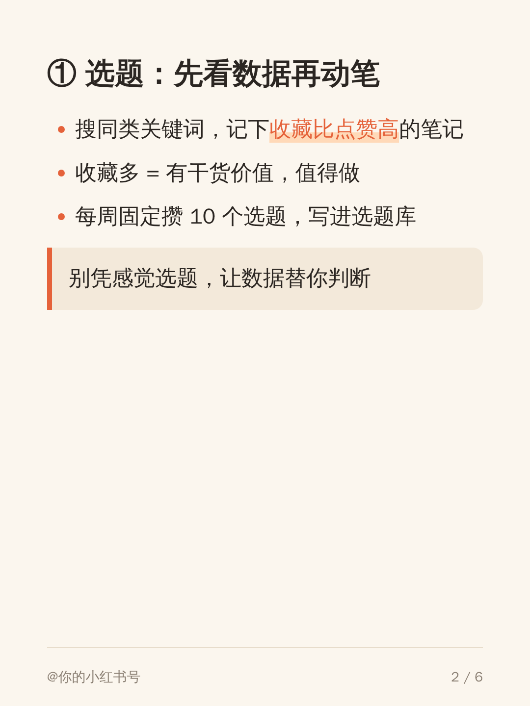
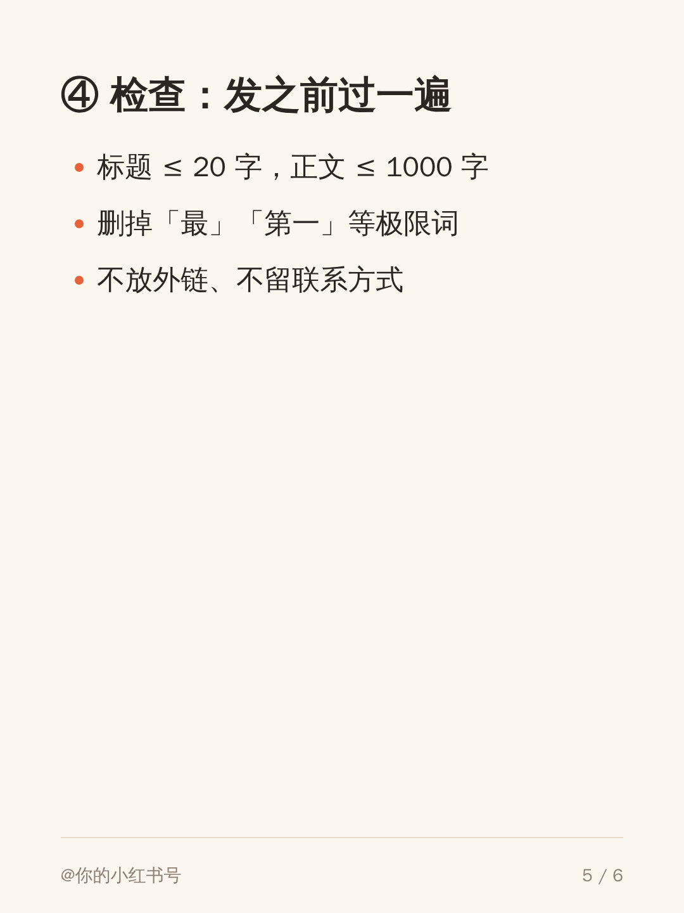
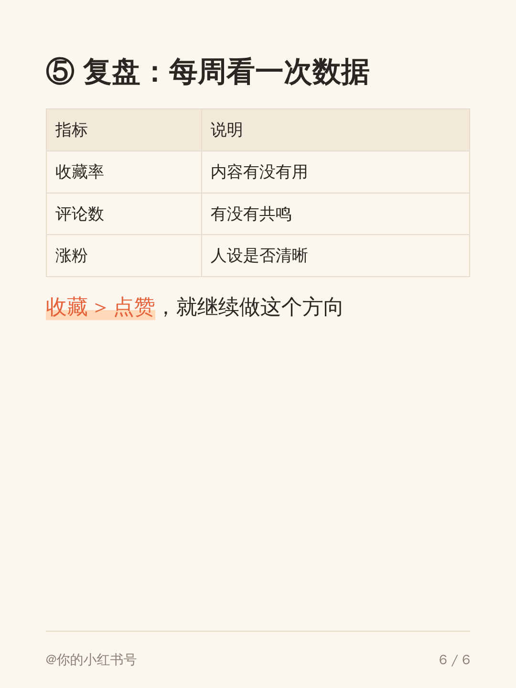

# AI 图文创作工作室：公众号 + 小红书

在 **Claude Code** 里运行的图文创作流水线：一次创作，同时发公众号长文和小红书卡片笔记。
它由 GitHub 上现成的开源组件拼成（调研见 [docs/选型调研.md](docs/选型调研.md)），本仓库补上编排技能、卡片渲染和发布前检查。

```
 profile.md 账号画像
      │
 ① 选题 topic-research ──── xiaohongshu-mcp 搜爆款 / 看评论区 + 网络搜索
      │  brief.md
 ② 长文 wechat-article ──── Claude 按你的语气写 1500–3000 字
      │  article.md
 ③ 小红书 xhs-note ──────── 拆成 6–9 页卡片 → scripts/render-cards.mjs → 1080×1440 PNG
      │  note.md + cards/*.png
 ④ 检查 scripts/check.mjs ── 字数、标签、外链、极限词/引流词
      │
 ⑤ 发布 publish（必须人工确认）
      ├─ wenyan-mcp ──────── 公众号草稿箱
      └─ xiaohongshu-mcp ─── 小红书（默认仅自己可见 / 定时发布）
```

示例产物（`examples/demo/cards/`）：

<p>
   
</p>

## 安装（约 10 分钟）

前提：已安装 [Node.js ≥ 18](https://nodejs.org) 和 [Claude Code](https://claude.com/claude-code)。

```bash
git clone <本仓库> && cd new1
bash scripts/setup.sh          # macOS Apple Silicon / Linux x64
```

脚本会：安装依赖和渲染用的 Chromium → 全局安装 `@wenyan-md/mcp` → 下载 `xiaohongshu-mcp` 到 `tools/` → 渲染示例卡片验证环境。

**Windows / Intel Mac**：手动执行 `npm install && npx playwright install chromium && npm i -g @wenyan-md/mcp`；小红书 MCP 用 [Releases](https://github.com/xpzouying/xiaohongshu-mcp/releases) 里的 Windows 版，或 Docker / [x-mcp 浏览器插件版](https://github.com/xpzouying/x-mcp)。

### 配置公众号
1. 公众号后台 → 设置与开发 → 开发接口管理：拿到 **AppID / AppSecret**，把本机**公网 IP** 加入 IP 白名单。
2. `cp .env.example .env`，填入两个值。

> 个人订阅号也可以用草稿箱接口。没有公众号的话可以跳过，只发小红书。

### 配置小红书
```bash
./tools/xiaohongshu-login     # 弹出二维码，用小红书 App 扫码
./tools/xiaohongshu-mcp       # 启动服务（保持运行），监听 localhost:18060
```
注意：登录后不要在其他网页端登录同一账号；新号先实名。

### 启动
```bash
source .env && claude
```
两个 MCP 已在 `.mcp.json` 里配好，首次启动时 Claude Code 会询问是否启用，选「是」。可用 `/mcp` 查看连接状态。

## 使用

在 Claude Code 里直接说：

| 你说 | 发生什么 |
|---|---|
| 帮我做账号定位 | 问你几个问题 → 打分对比赛道 → 写入 `profile.md` |
| 这周写什么 / 找选题 | 搜小红书爆款和评论区 → Top 3 选题 → `brief.md` |
| 开始创作 / 来一篇 | 一条龙：选题 → 长文 → 卡片 → 检查 → 发布，每步停下来等你确认 |
| 把这篇做成小红书 | 已有文章 → 卡片和文案 |
| 发布 | 检查通过并确认后，推公众号草稿箱 + 发小红书 |

也可以单独用脚本：

```bash
npm run new -- my-topic "选题名"                            # 新建 content/<日期>-my-topic/
npm run cards -- content/2026-10-04-my-topic/cards.md     # 渲染卡片（--theme cream|ink|mint）
npm run check -- content/2026-10-04-my-topic/note.md      # 发布前检查
```

卡片格式（`cards.md`）：第一页自动用封面样式，单独一行 `===` 分页，支持标题、列表、加粗高亮、引用、表格和本地图片。主题在 `themes/` 下，复制一个 CSS 改变量即可新增。

## 目录

```
CLAUDE.md                 Claude Code 的总规则（自动加载）
profile.md                账号画像：定位、语气、主题、复盘表（先填它）
.claude/skills/           6 个技能：content-strategy / topic-research / wechat-article / xhs-note / publish / content-pipeline
.mcp.json                 wenyan-mcp（公众号）+ xiaohongshu-mcp（小红书）
scripts/                  render-cards / check / new-post / setup
themes/                   卡片主题：cream 奶油、ink 深色科技、mint 蓝白文档
content/                  你的每一篇内容
docs/选型调研.md           GitHub 开源方案对比
docs/内容定位分析.md       适合做什么内容的分析框架
```

## 可选组件
- **AI 生图封面**：`git clone https://github.com/ziguishian/xhs-visual-director-skill` 后，把其中 `skill/` 目录复制为 `.claude/skills/xhs-visual-director/`。
- **更多公众号主题 / 高级排版**：[md2wechat-skill](https://github.com/geekjourneyx/md2wechat-skill)（高级功能付费）。
- **想要图形界面 + 多平台矩阵 + 数据复盘**：升级到 [Easel](https://github.com/ZJU-REAL/Easel)。

## 安全原则
- 任何发布都要你明确确认；公众号只进草稿箱，小红书默认「仅自己可见」。
- 不编造数据和经历；AI 生成的图片/大段文字按平台要求标注。
- 小红书每天 ≤ 2–3 篇，不发外链和联系方式。
